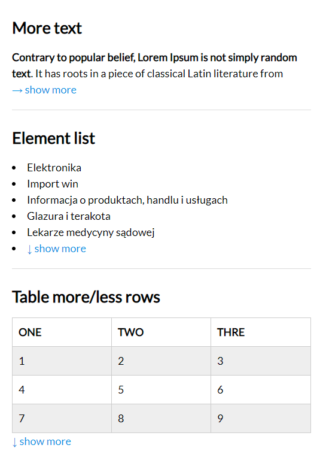

<h1 align="center">
  show More/Less
</h1>

<p align="center">
  JavaScript library that truncates text (html experimentally), list or table by chars, elements or row and shows/hides text blocks, elements or table row with Show More and Show Less.
</p>

<p align="center">
  
  
  <a href="LICENSE">
    
  </a>
</p>

<p align="center">
  
</p>

## Demo

See the demo - [example](https://tomickigrzegorz.github.io/show-more/)

## Clone the repo and install dependencies

```js
git clone
cd show-more

yarn
// or
npm i
```

## Watch/Build the app

Watch the app, just call:

```js
yarn dev
// or
npm run dev
```

Build app:

```js
yarn prod
// or
npm run prod
```

## How to use it:

### Add js library to html

```html
<!-- html -->
<script src="/path/to/showMore.min.js"></script>
```

## CDN

HTML 
```html
<script src="https://cdn.jsdelivr.net/gh/tomickigrzegorz/show-more@1.1.6/dist/js/showMore.min.js"></script>
```

CSS
```html
<link rel="stylesheet" href="https://cdn.jsdelivr.net/gh/tomickigrzegorz/show-more@1.1.6/dist/css/show-more.min.css" />
```

-- OR --

```html
<!-- css -->
<link rel="stylesheet" href="/path/to/show-more.min.css" />
```
-- OR --

```css
/* styling buttons */
.show-more-btn {
  margin: auto;
  cursor: pointer;
  color: #0095e5;
  white-space: nowrap;
  transition: color 300ms ease-in-out;
  border: 0;
  font-size: 0.8em;
  background: transparent;
}
.show-more-btn:hover {
  color: red;
}
.hidden {
  display: none;
}
```

---

### For text → [live example](https://tomickigrzegorz.github.io/show-more#example-text):

```html
<div class="element" data-config='{ "type": "text", "limit": 120, "more": "→ show more", "less": "← less" }'>
  Lorem ipsum, dolor ... ...
</div>
```

---

### For list → [live example](https://tomickigrzegorz.github.io/show-more#example-list):

```html
<ul class="element" data-config='{ "type": "list", "limit": 5, "element": "li", "more": "↓ show more", "less": "↑ less", "number": true }'>
  <li>item 1</li>
  <li>item 2</li>
  ...
</ul>
```

---

### For table → [live example](https://tomickigrzegorz.github.io/show-more#example-table):

```html
<table class="element" data-config='{ "type": "table", "limit": 4, "more": "↓ show more", "less": "↑ less", "number": true }'>
  ...
</table>
```

---

### Only `show more` button → [live example](https://tomickigrzegorz.github.io/show-more#example-onlyexpandable):

```html
<div class="element links-style" data-config='{ "type": "list", "limit": 5, "more": "→ show more" }'>
  <a href="#">Administracja biur,</a>
</div>
```

---

### Show the number next to the button → [live example](https://tomickigrzegorz.github.io/show-more#show-number):

```html
<ul class="element display-inline" data-config='{ "type": "list", "limit": 3, "element": "li", "more": "→ show more", "less": "← less", "number": true }'>
  <li>Usługi murarskie i tynkarskie,</li>
  ...
</ul>
```

### Only the ellipsis → [live example](https://tomickigrzegorz.github.io/show-more#ellipsis):

```html
<div class="element" data-config='{ "type": "text", "limit": 100, "nobutton": true }'>
  It is a long established fact that a reader will be distracted by the readable
  content of a page when looking at its layout.
</div>
```

### HTML tags → [live example](https://tomickigrzegorz.github.io/show-more#html):

```html
<div class="element" data-config='{ "type": "text", "limit": 100, "more": "→ show more", "less": "← less" }'>
  <b>Lorem ipsum dolor sit</b>, amet consectetur adipisicing elit. Libero
  deserunt dignissimos blanditiis animi esse veritatis, quasi, ab, commodi
  itaque quisquam delectus inventore perspiciatis corrupti!
  <table>
    <thead>
      <th>one</th>
      <th>two</th>
      <th>three</th>
    </thead>
    <tr>
      <td>a</td>
      <td>b</td>
      <td>c</td>
    </tr>
    <tr>
      <td>d</td>
      <td>e</td>
      <td>f</td>
    </tr>
  </table>
  Sequi debitis suscipit molestias, eligendi ab odit ullam. Vero eius debitis
  quis corporis, possimus veniam sit fugit aliquid.
   Fuga,
  libero eaque consequuntur ipsa esse omnis, ad eius laboriosam reprehenderit
  iste quaerat vitae quis corrupti saepe veniam, ullam placeat voluptatum sint
  dolore sunt quo. Voluptate fugit quo architecto laboriosam
  <i>ipsam pariatur delectus iusto consectetur provident</i> odio amet tempora
  veniam velit at deleniti sint soluta accusamus, praesentium necessitatibus
  maxime.<br /><br />
  Aliquam necessitatibus porro dolores atque aliquid itaque, ad maiores!
</div>
```

## Callback function

```javascript
document.addEventListener('DOMContentLoaded', function () {
  // text, table, list, elelemnts
  new ShowMore('.element', {
    onMoreLess: (type, object) => {
      // type = less/more and full object
      console.log(type, object);
    },
  });
});
```

## Own regular expressions

```javascript
document.addEventListener('DOMContentLoaded', function () {
  new ShowMore('.element', {
    // you can also add your own regular expression,
    // it will only apply to text elements.
    regex: {
      image: {
        match: //g,
        replace: '',
      },
    },
  });
});
```

## Global configuration
If you have one type of items that you want to shorten, you can add global configuration, you don't need to add `data-config` to each item. Below is an example:
```javascript
document.addEventListener('DOMContentLoaded', function () {
  new ShowMore('.element', {
    config: {
      type: "text",
      limit: 120,
      more: "&#8594; read more",
      less: "&#8592; read less"
    }
  });
});
```
You can also mix, `global configuration` + `data-config`. In such cases, the `global configuration` object will merge with` data-config`.
For example, we have 10 texts to shorten, then we add the global configuration, but we also have a table that we want to shorten, in this case we add `data-config` to table - [see table example](#for-table--live-example)

You don't need to add all the variables in the `data-config`. For example, if we have more/less buttons in `global configuration` then in `data-config` we do not have to declare them, but if we add them, they will overwrite their settings in globalen configuration.

## Configuration of the plugin

| element          | require | description                                                                                                                                                                 |
| ---------------- | :-----: | --------------------------------------------------------------------------------------------------------------------------------------------------------------------------- |
| `your-class`     |    ✔    | name of the class after which we want to add support for showing/hiding text, list or table                                                                                 |
| `data-config`    |    ✔    | embedding JSON in the html, the entire configuration of a particular element                                                                                                |
| `type`           |    ✔    | we have three type after which it will be hidden [text, list or table]                                                                                                      |
| `limit`          |    ✔    | `text` after how many characters to hide the text and insert `show more/less`<br />`list` or `table` after how many elements/rows hide the rest and insert `show more/less` |
| `after`          |         | this parameter checks how much text is after the trimmed text the `limit` parameter, if the text is less than the `after` parameter does not add a more/less button`^.      |
| `element`        |         | on the parameter we will create an html element and put in the text `show more/less`                                                                                        |
| `more/less`      |         | is the text and chars that appears after the text, list or table e.g. `> show more` and `< show less`                                                                       |
| `number`         |         | number of hidden items to show more/less e.g. `-> show more 3`, only works for list and table                                                                               |
| `ellipsis`       |         | By default, adding an ellipsis to shortened text can be turned off by setting 'ellipsis': false                                                                             |
| `nobutton`       |         | Diable showing the read more/less button, by default 'nobutton': false                                                                                                      |
| `regex`          |         | adding your own regular expressions. It is an object with two parameters `match` and `replace`, see example below                                                           |
| `btnClass`       |         | Button class name. Default: `show-more-btn`                                                                                                                                 |
| `btnClassAppend` |         | Opportunity to add additional classes to the button                                                                                                                         |
| `onMoreLess`     |         | callback function                                                                                                                                                           |

> ^ Let's say we have 20 records with text and we determine that the text is to be trimmed after 100 characters in each record, it may happen that in several records the text is very short and has 110 characters, so `show more/less` will appear after 100 characters and after clicking an additional 10 characters, it will look funny. To prevent this, we add the `"after": 50` parameter, which means that the hidden text must be at least 50 characters. Otherwise, `show more/less` will not appear. The same `after` can be applied to lists, elements and table records

> Number of records counted in the table `tr` based on all `tr` of `thead`, `tbody` and `tfoot`

## Browser support

show-more supports all major browsers including IE 10 and above

Configuration for IE:

### local files
- dist/js/showMore.ie.min.js

### cdn

- https://cdn.jsdelivr.net/gh/tomickigrzegorz/show-more@1.1.6/dist/js/showMore.ie.min.js

### cdn polyfill from npm

- https://polyfill.io/v3/polyfill.min.js?features=Object.assign

> IE demo: docs/ie.html

## License

This project is available under the [MIT](https://opensource.org/licenses/mit-license.php) license.
